# Aurelia Dental Studio — Landing Page

**CloudExify Summer Internship 2026 · Full Stack Web Development — Month 2, Project 3**

## Submission details

| Field | Value |
|---|---|
| **Name** | Asiya Khan |
| **Registration number** | CX-INT-2026-GEN-0481 |
| **Build track chosen** | **Luxury Dental** — dark premium ground, gold accents, serif display type |
| **Signature features implemented** | **4** — animated stats counter, live service filter, draggable before/after slider, appointment booking modal with time-slot selector |
| **Live Vercel link** | **https://cloud-exify-project-3.vercel.app/** |
| **GitHub repository** | https://github.com/asiyayarkhan15-a11y/CloudExify-Project-3 |

---

## About the build

Aurelia Dental Studio is a fictional private dental practice in Gulberg III, Lahore. The brief
warned against pages that read as unmodified Bootstrap templates, so the visual identity was
built deliberately rather than inherited:

- **Palette** — near-black grounds (`#0A0C0F` / `#0F1216`) with a single gold accent ramp
  (`#EBD07C → #D4AF37 → #A8842A`). No green, no stock-clinic blue.
- **Type** — Cormorant Garamond for display, Jost for interface text. The serif carries the
  "premium" half of the track; the geometric sans keeps the forms and labels legible.
- **Copy** — written as a real practice would write it. The clinic admits it is expensive,
  publishes a complaint in its own testimonials, and describes a scheduling philosophy rather
  than listing adjectives.
- **Rhythm** — sections alternate between `--ink` and `--ink-2` grounds so the page never
  reads flat on a long scroll.

---

## Signature features

### 1. Animated stats counter
`IntersectionObserver` at `threshold: 0.5` fires a `requestAnimationFrame` count-up with a
cubic ease-out, then unobserves the element so it animates exactly once per page load.
`data-suffix` on each stat means `98` renders as `98%` while `500` renders as `500+`.

### 2. Live service filter
Category buttons filter the six treatment cards. Cards carry space-separated categories
(`data-category="general cosmetic"`), so Dental Implants correctly appears under both General
and Cosmetic. Hidden cards animate out via opacity and scale rather than snapping away.

### 3. Before & after draggable slider
A clipped overlay pane with a gold divider. Supports mouse drag, touch drag and left/right
arrow keys, with `role="slider"` and a live `aria-valuenow`. Touch drags only claim the gesture
once the movement is clearly horizontal, so a vertical swipe over the slider still scrolls the
page. The clipped copy is sized by height rather than width so both halves stay pixel-aligned at
any viewport size.

### 4. Appointment booking modal
Twelve time slots rendered as a selectable grid (three shown as already booked), a date picker
floored at today, and full client-side validation. Errors are specific — the message names the
fields that are still missing rather than saying "please fill the form" — and offending inputs
get a red border that clears the moment the user starts typing. On success the confirmation
echoes the formatted date, chosen slot and phone number back to the patient.

---

## Bonus items included

- Smooth scrolling with active nav-link highlighting driven by `IntersectionObserver`
- Scroll-reveal entrance animations across every section
- Full `prefers-reduced-motion` support — all animation collapses for users who ask for it
- Keyboard-accessible comparison slider and visible focus rings throughout
- Google Map iframe colour-graded to match the dark palette via a CSS filter
- Zero external images — every asset is hand-authored SVG, so the page has no image payload

---

## Tech stack

HTML5 · CSS3 (custom properties, grid, clip-path) · Vanilla JavaScript (ES6, no libraries) ·
Bootstrap 5.3.3 (navbar, grid, carousel, accordion, modal) · Bootstrap Icons 1.11.3

No build step, no framework, no bundler. Open `index.html` and it runs.

---

## Project structure

```
dental-clinic/
├── index.html
├── css/
│   └── style.css
├── js/
│   └── script.js
├── assets/
│   ├── logo.svg
│   ├── favicon.svg
│   ├── doctor.svg
│   ├── smile-before.svg
│   ├── smile-after.svg
│   ├── case-whitening.svg
│   ├── case-aligners.svg
│   └── case-implant.svg
├── screenshot/            (8 desktop + 6 mobile captures)
├── vercel.json
└── README.md
```

---

## Screenshots

### Desktop

| | |
|---|---|
| 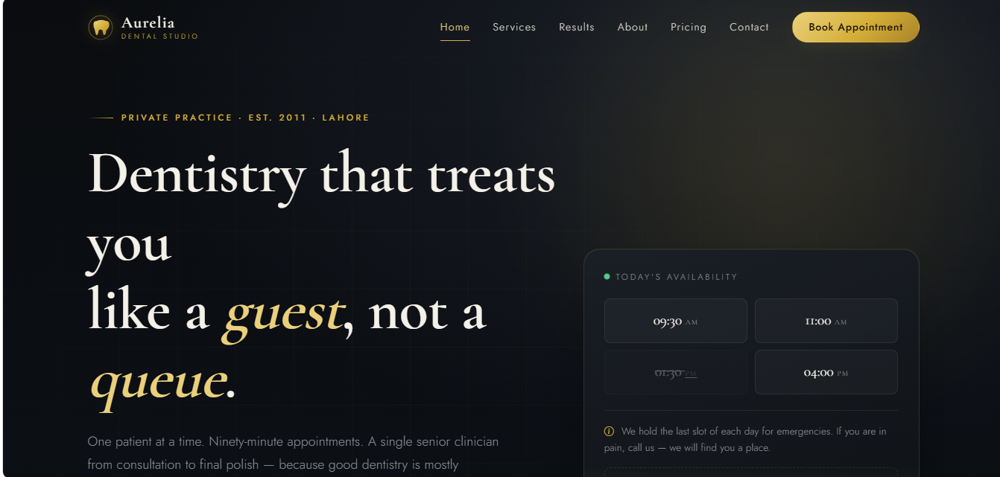 | 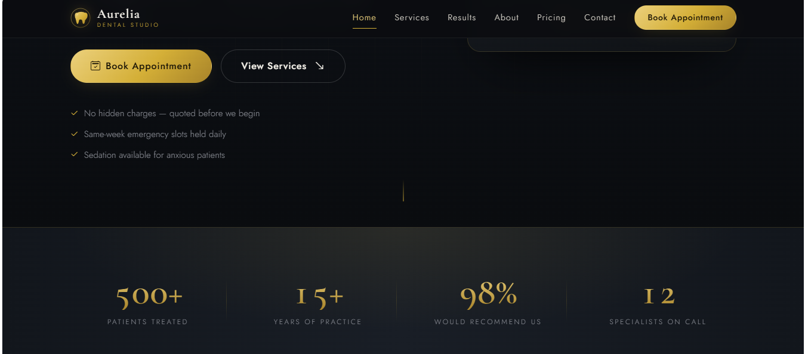 |
| 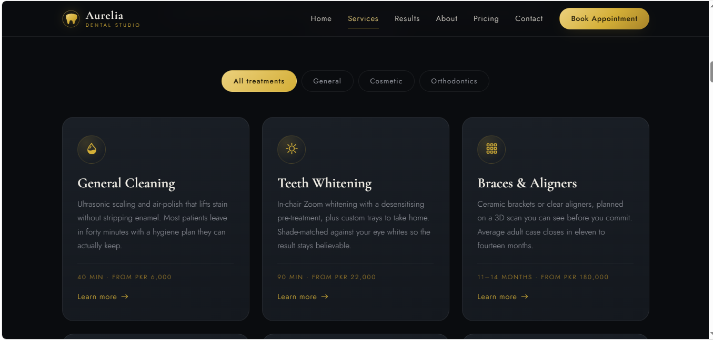 | 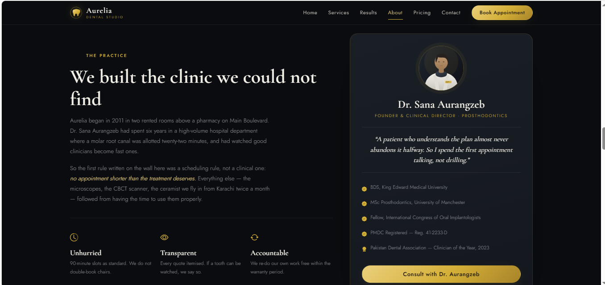 |
| 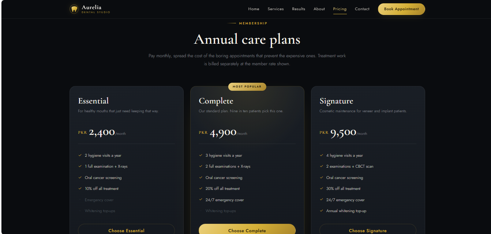 | 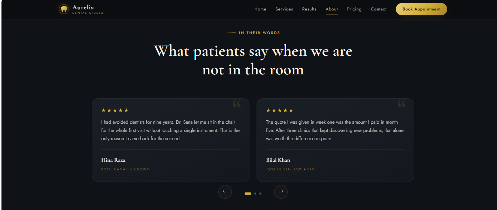 |
| 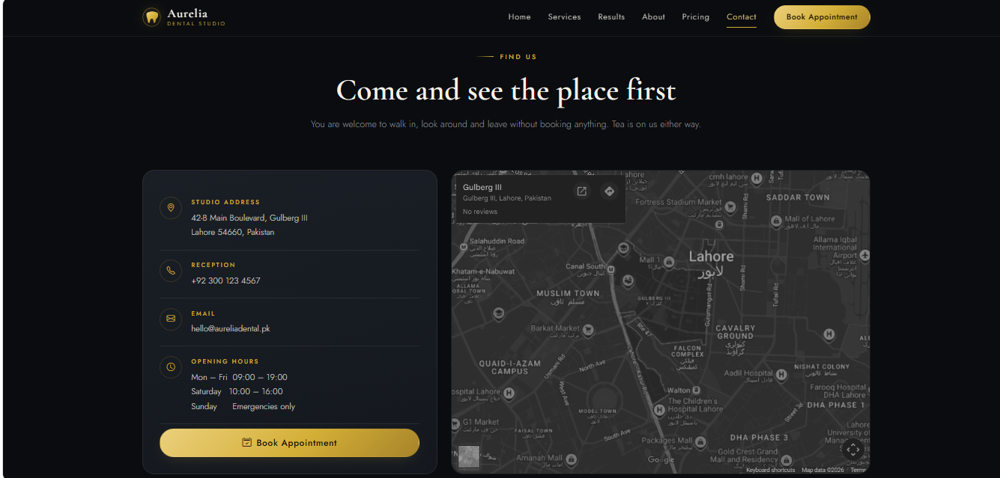 | 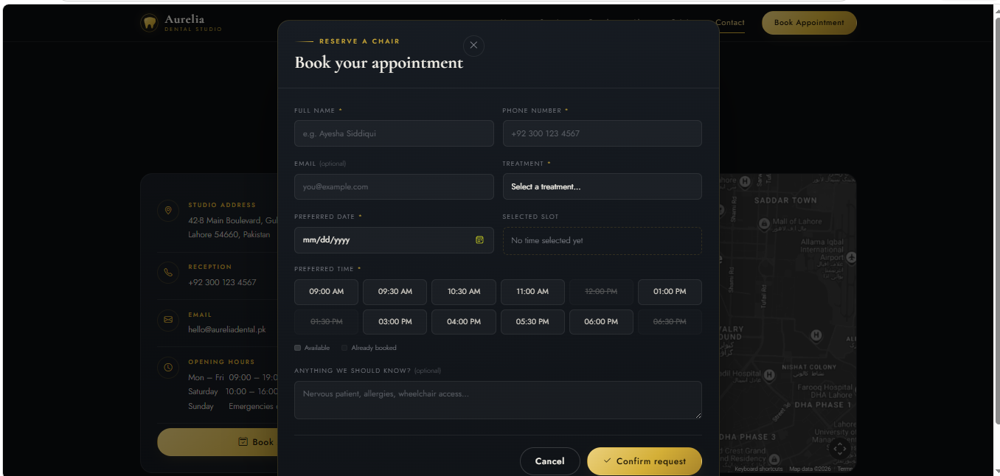 |

### Mobile

The first four were shot on a real iPhone against the live Vercel deployment — the browser URL
bar is visible in each. The last two are the booking modal and pricing plans at device width.

| | |
|---|---|
| 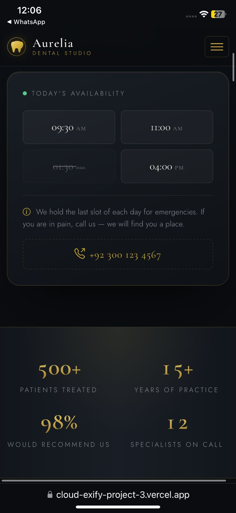 | 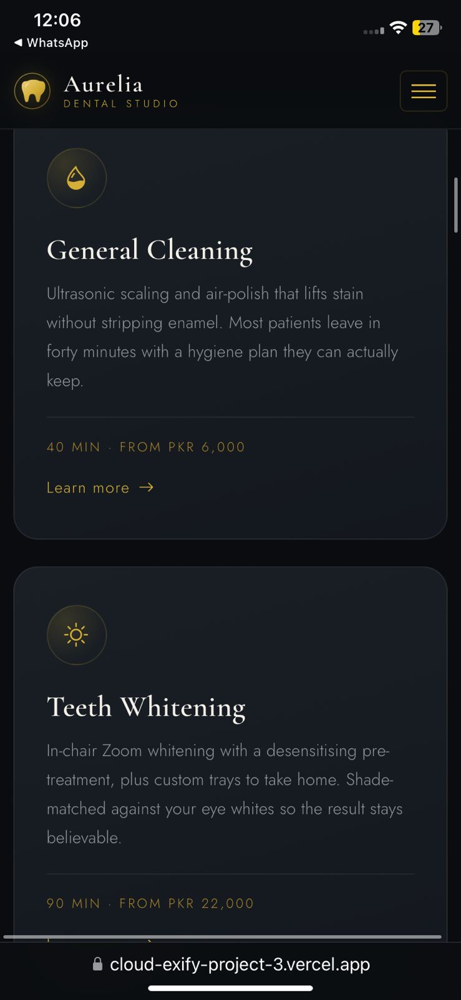 |
| 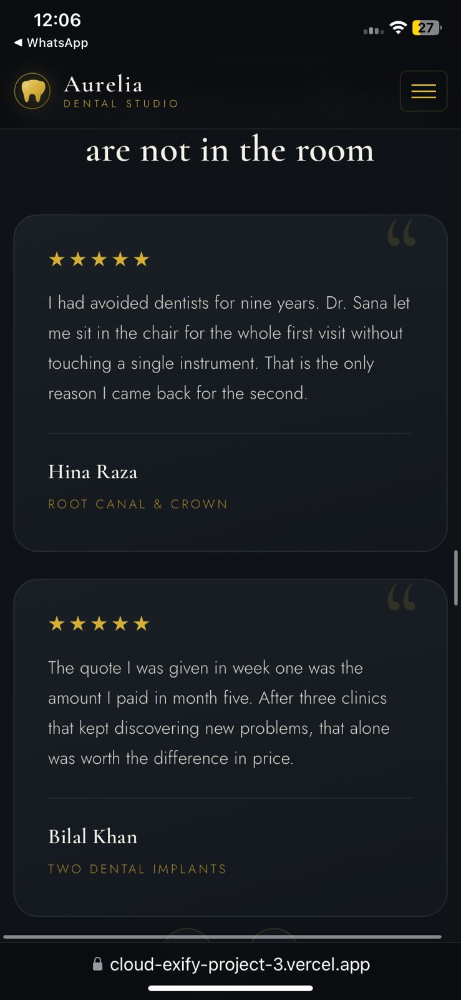 | 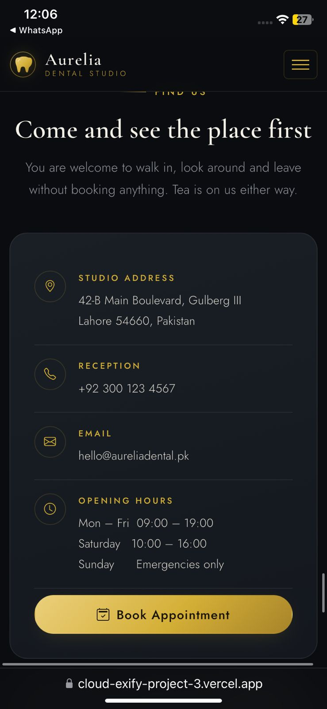 |
| 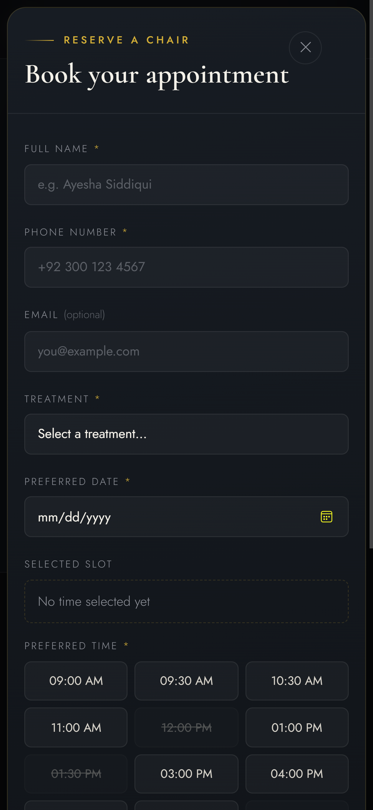 | 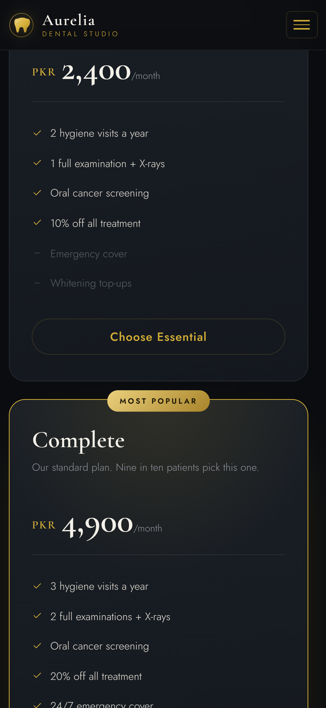 |

---

## Running locally

No server required — but the Google Map iframe behaves better over HTTP than `file://`:

```bash
python -m http.server 8000
# then open http://localhost:8000
```

---

## Deploying to Vercel

1. Push this folder to a GitHub repo (this one: `CloudExify-Project-3`)
2. On [vercel.com](https://vercel.com), **Add New Project** → import the repo
3. Framework preset: **Other**. Leave build command and output directory empty
4. **Deploy** — you get a live `.vercel.app` URL in well under a minute
5. Every later `git push` redeploys automatically

---

## Testing checklist

| Test case | Expected result | Status |
|---|---|:---:|
| Live Vercel link opens | Site loads and looks professional | ☐ |
| Sticky navbar on scroll | Navbar stays fixed, gains a blurred background past 40px | ☐ |
| Mobile hamburger menu | Opens, closes, and auto-closes after tapping a link | ☐ |
| All section anchors | Nav links scroll smoothly to the right section | ☐ |
| Stats counter on scroll | Counts up once when the band enters view | ☐ |
| Service filter | Cards filter smoothly by category | ☐ |
| Before/after slider | Divider drags with mouse, touch and arrow keys | ☐ |
| Appointment modal validation | Empty fields show a specific error, valid input shows success | ☐ |
| Testimonials | Carousel auto-rotates every 6s, arrows and dots work | ☐ |
| Pricing | Three plans visible, Complete highlighted with badge | ☐ |
| FAQ accordion | Opens and closes smoothly, only one open at a time | ☐ |
| Mobile + desktop | Layout adapts cleanly at both widths | ☐ |
| Browser console | No JavaScript errors on load | ☐ |

---

## A note on the content

Aurelia Dental Studio does not exist. The clinician, credentials, registration number, address,
phone number, prices, patient testimonials and clinical outcomes on this page are all invented
for a training exercise. Nothing here should be read as medical information or as a real
practice's advertising.

---

*Built by Asiya Khan (CX-INT-2026-GEN-0481) for CloudExify Web Dev Month 2 — Project 3.*
